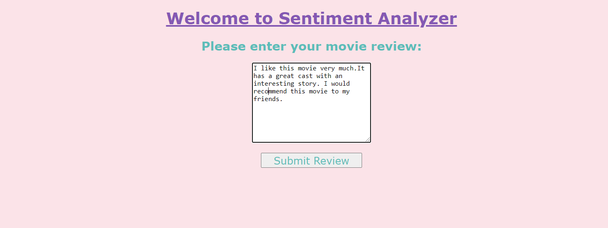

# Sentiment-Analysis

<h5 align="center">Sentiment analysis is the interpretation and classification of emotions (positive, negative) within text data using text analysis techniques.  
Sentiment analysis allows businesses to identify customer sentiment toward products, brands or services in online conversations and feedback.</h5>

<h3 align="center"><b>Applications:</b></h3>

<ul align="center">
<li>Market Research, Competitor Analysis 
<li>Product Analytics 
<li>Customer Support - feedback analysis 
</ul>

<h3 align="center"><b> About Project</h3></b>

This Project Basicaly deals with "Movie reviews" and is trained using <b> IMDB Movie reviews dataset</b> 
You can download the dataset from this google drive link with file name "movie_data.csv". 
https://drive.google.com/file/d/10irp0I60WT38i9q2D5c3REsh87gxKXgt/view?usp=sharing

<h3 align="center"><b> Dependencies (Libraries/Packages)</h3></b>

<ul align="center">
<li> NLP Library
<li> NLTK Package
<li>sklearn.feature_extraction.text Library
<li> FLASK API
</ul>

<h3 align="center"><b>Procedure to Run this Project</b></h3>

Download complete project files, and place them under the "Users" directory.  
Now open Anaconda Command Prompt for further commands processing. 
For deployment on localhost, install "Flask API" on your system. 
"pip install flask" command for installing the "Flask API". 
Now get into the project directory, by using "cd" commands on Command Prompt.  
Run on local host using "python flaskapp.py".  
Copy paste url in your web browser. 
And  
<i>You are good to Go!!!</i> 

<h3 align="center"><b> Deployed Project</h3></b>

 The first page will ask for your input. Enter your review about a movie and click SUBMIT button. 
The next page will display the <b> Prediction </b> about the "sentiment" analyzed by our trained model out of your review.  
It can be either positive or negative alongwith a probablitiy percetage. The percenaage will show how much probabality is there that the predicted sentiment is correct about the entered review.

